The project is divided into two main components: `edon` (core logic) and `edon_ui` (user interface). This separation is a strong architectural decision, promoting maintainability, testability, and the potential for alternative UIs in the future.

## 1. Architectural Overview

The application follows a variation of the Model-View-Controller (MVC) or Model-View-ViewModel (MVVM) pattern, where:

*   **Model (`src/edon/`)**: This layer contains the core business logic, data structures, and algorithms for the node graph. It is explicitly designed to be UI-agnostic.
    *   **Graph Core (`edon/graph.py`, `edon/node.py`, `edon/socket.py`, `edon/types.py`, `edon/errors.py`)**: Defines `EntityGraph` (the central data model for the node network), `EntityNode` (base class for all computational units), `EntitySocket` (connection points), and essential data structures (`SocketAddress`, `EdgeKey`, `SocketType`, `SocketDef`). `EntitySubGraphNode` is a specialized `EntityNode` that encapsulates another `EntityGraph`, enabling nested graphs.
    *   **Execution Engine (`edon/executor.py`)**: Responsible for processing the `EntityGraph` by topologically sorting nodes and executing their `process()` methods. It manages execution context and depth for sub-graphs.
    *   **Logging (`edon/logging.py`)**: Centralized setup for application logging using `loguru`, including a global exception hook for robust error reporting.

*   **View (`src/edon_ui/views/`, `src/edon_ui/items/`, `src/edon_ui/widgets/`, `src/edon_ui/theme.py`)**: This layer is responsible for rendering the graph and user interaction elements. It exclusively uses PySide6 (Qt).
    *   **Main Window (`edon_ui/views/window.py`)**: The top-level application window (`QMainWindow`).
    *   **Graphics View (`edon_ui/views/viewer.py`)**: The main canvas for displaying the node graph (`QGraphicsView`). Handles zooming, panning, and dispatches various input events.
    *   **Graphics Scene (`edon_ui/views/scene.py`)**: The container for all graphical items (`QGraphicsScene`). Manages nodes, edges, grid, and active area. Initiates drag operations.
    *   **Graphics Items (`edon_ui/items/`)**: Visual representations of core model entities: `NodeItem`, `SubGraphNodeItem`, `SocketItem`, `SocketLinkItem`, `EdgeItem`, `DraggingEdgeItem`.
    *   **Widgets (`edon_ui/widgets/`)**: Provides custom and adapted Qt widgets for specialized UI elements within nodes (e.g., `FocusSelectLineEdit`, `ExpandLineEdit`, `NodeSpawningPanel`). Includes adaptor classes (`SocketWidgetAdaptor`) to integrate standard `QWidget`s into the `QGraphicsScene`.
    *   **Theming (`edon_ui/theme.py`)**: Centralizes all color, font, and QSS constants for consistent visual styling.

*   **Controller/ViewModel (`src/edon_ui/graph/controller.py`, `src/edon_ui/graph/context.py`, `src/edon_ui/graph/registry.py`)**: This layer mediates between the `edon` model and the `edon_ui` view. It receives UI events, translates them into model operations, and updates the UI based on model changes.
    *   **Workspace Controller (`edon_ui/graph/controller.py`)**: The central orchestrator. It holds instances of `GraphicsView` and `WorkspaceUIDataRegistry`. It handles requests for node creation, deletion, and linking, interacting with the `EntityGraph`. It also manages entering/exiting sub-graphs using a `WorkspaceContextStack`.
    *   **Workspace UI Data Registry (`edon_ui/graph/registry.py`)**: A critical component that maintains a synchronized mapping between `edon` entities (nodes, sockets, edges) and their `edon_ui` graphical representations. It uses aggressive assertions for data integrity.
    *   **Workspace Context Stack (`edon_ui/graph/context.py`)**: Manages the navigation state for nested graphs (sub-graphs), ensuring the correct `EntityGraph`, `GraphicsScene`, and `WorkspaceUIDataRegistry` are active for the current context.

*   **Command System (`src/edon_ui/commands/`)**: A dedicated subsystem for managing user actions and hotkeys.
    *   **Core (`edon_ui/commands/core.py`)**: Defines `Command` (a user action) and `CommandRegistry` (stores commands). `EditorContext` is passed to command actions, providing access to relevant UI and controller state.
    *   **Hotkey Management (`edon_ui/commands/key_mapping.py`, `edon_ui/commands/key_processor.py`)**: `KeyMapping` binds hotkey sequences to command IDs. `KeyProcessor` intercepts `QKeyEvent`s and `QMouseEvent`s, interprets them into sequences, and dispatches commands if a match is found.
    *   **Built-in Actions (`edon_ui/commands/actions/basic_actions.py`)**: Implementations of common command actions (e.g., close, delete, add node, subgraph navigation).

## 2. Dependencies and Structure

The project maintains a generally clean dependency structure, primarily enforcing the `edon_ui` (UI layer) depending on `edon` (core logic), but not vice-versa, which is crucial for modularity.

```mermaid
graph TD
    subgraph Core
        edon_types[edon/types]
        edon_errors[edon/errors]
        edon_logging[edon/logging]
        edon_socket[edon/socket]
        edon_node[edon/node]
        edon_graph[edon/graph]
        edon_executor[edon/executor]
        edon_nodes_utility[edon/nodes/utility]
    end

    subgraph UI
        edon_ui_app[edon_ui/app]
        edon_ui_theme[edon_ui/theme]
        edon_ui_base[edon_ui/base]

        subgraph Views
            edon_ui_views_window[edon_ui/views/window]
            edon_ui_views_viewer[edon_ui/views/viewer]
            edon_ui_views_scene[edon_ui/views/scene]
            edon_ui_context_menu[edon_ui/context_menu]
        end

        subgraph Items
            edon_ui_items_node[edon_ui/items/node]
            edon_ui_items_socket[edon_ui/items/socket]
            edon_ui_items_edge[edon_ui/items/edge]
            edon_ui_items_factory[edon_ui/items/factory]
        end

        subgraph Widgets
            edon_ui_widgets_gfx[edon_ui/widgets/gfx]
            edon_ui_widgets_adaptors[edon_ui/widgets/adaptors]
            edon_ui_widgets_editors[edon_ui/widgets/editors]
            edon_ui_widgets_factories[edon_ui/widgets/factories]
            edon_ui_widgets_node_spawner[edon_ui/widgets/node_spawner]
        end

        subgraph Commands
            edon_ui_commands_core[edon_ui/commands/core]
            edon_ui_commands_key_mapping[edon_ui/commands/key_mapping]
            edon_ui_commands_key_processor[edon_ui/commands/key_processor]
            edon_ui_commands_builtins[edon_ui/commands/builtins]
            edon_ui_commands_actions_basic[edon_ui/commands/actions/basic_actions]
            edon_ui_commands_layout_algorithms[edon_ui/commands/layout_algorithms]
        end

        subgraph Graph-UI Integration
            edon_ui_graph_controller[edon_ui/graph/controller]
            edon_ui_graph_context[edon_ui/graph/context]
            edon_ui_graph_registry[edon_ui/graph/registry]
        end
    end

    edon_app[Application Entry Point] --> edon_ui_app
    edon_ui_app --> edon_logging
    edon_ui_app --> edon_graph
    edon_ui_app --> edon_node
    edon_ui_app --> edon_ui_graph_controller
    edon_ui_app --> edon_ui_theme
    edon_ui_app --> edon_ui_commands_core

    edon_graph --> edon_node
    edon_graph --> edon_socket
    edon_graph --> edon_types
    edon_graph --> edon_errors
    edon_graph --> edon_executor
    edon_node --> edon_socket
    edon_node --> edon_types
    edon_socket --> edon_types
    edon_socket --> edon_node
    edon_executor --> edon_graph
    edon_executor --> edon_node
    edon_executor --> edon_types
    edon_nodes_utility --> edon_node
    edon_nodes_utility --> edon_types

    edon_logging --> PySide6

    edon_ui_views_window --> edon_ui_views_viewer
    edon_ui_views_window --> edon_ui_views_scene
    edon_ui_views_viewer --> edon_ui_views_scene
    edon_ui_views_viewer --> edon_ui_graph_controller
    edon_ui_views_viewer --> edon_ui_commands_key_processor
    edon_ui_views_viewer --> edon_ui_context_menu
    edon_ui_views_scene --> edon_ui_items_node
    edon_ui_views_scene --> edon_ui_items_edge
    edon_ui_views_scene --> edon_ui_items_socket
    edon_ui_views_scene --> edon_ui_theme
    edon_ui_views_scene --> edon_types
    edon_ui_context_menu --> edon_ui_views_viewer
    edon_ui_context_menu --> edon_ui_widgets_node_spawner

    edon_ui_items_node --> edon_ui_theme
    edon_ui_items_node --> edon_ui_views_scene
    edon_ui_items_socket --> edon_ui_theme
    edon_ui_items_socket --> edon_ui_views_scene
    edon_ui_items_socket --> edon_types
    edon_ui_items_socket --> edon_ui_widgets_adaptors
    edon_ui_items_socket --> edon_ui_widgets_gfx
    edon_ui_items_edge --> edon_ui_theme
    edon_ui_items_edge --> edon_ui_items_socket
    edon_ui_items_edge --> edon_types
    edon_ui_items_factory --> edon_ui_items_node
    edon_ui_items_factory --> edon_ui_items_socket
    edon_ui_items_factory --> edon_ui_widgets_factories
    edon_ui_items_factory --> edon_node
    edon_ui_items_factory --> edon_graph
    edon_ui_items_factory --> edon_socket
    edon_ui_items_factory --> edon_types

    edon_ui_widgets_adaptors --> edon_ui_widgets_gfx
    edon_ui_widgets_adaptors --> edon_ui_theme
    edon_ui_widgets_adaptors --> edon_ui_base
    edon_ui_widgets_editors --> edon_ui_theme
    edon_ui_widgets_editors --> edon_ui_icon_engine[edon_ui/icon_engine]
    edon_ui_widgets_factories --> edon_ui_widgets_adaptors
    edon_ui_widgets_factories --> edon_ui_widgets_editors
    edon_ui_widgets_factories --> edon_node
    edon_ui_widgets_factories --> edon_socket
    edon_ui_widgets_factories --> edon_types
    edon_ui_widgets_node_spawner --> edon_ui_graph_controller
    edon_ui_widgets_gfx --> edon_ui_theme
    edon_ui_icon_engine --> PySide6

    edon_ui_commands_core --> edon_ui_views_viewer
    edon_ui_commands_key_mapping --> edon_ui_commands_core
    edon_ui_commands_key_processor --> edon_ui_commands_core
    edon_ui_commands_key_processor --> edon_ui_commands_key_mapping
    edon_ui_commands_key_processor --> edon_types
    edon_ui_commands_builtins --> edon_ui_commands_actions_basic
    edon_ui_commands_builtins --> edon_ui_commands_core
    edon_ui_commands_actions_basic --> edon_ui_views_viewer
    edon_ui_commands_actions_basic --> edon_ui_widgets_node_spawner
    edon_ui_commands_actions_basic --> edon_ui_graph_controller
    edon_ui_commands_actions_basic --> edon_graph
    edon_ui_commands_actions_basic --> edon_ui_items_node
    edon_ui_commands_actions_basic --> edon_ui_items_edge
    edon_ui_commands_layout_algorithms --> edon_ui_items_node
    edon_ui_commands_layout_algorithms --> edon_ui_items_edge
    edon_ui_commands_layout_algorithms --> edon_logging
    edon_ui_commands_layout_algorithms --> edon_ui_theme


    edon_ui_graph_controller --> edon_graph
    edon_ui_graph_controller --> edon_node
    edon_ui_graph_controller --> edon_socket
    edon_ui_graph_controller --> edon_types
    edon_ui_graph_controller --> edon_ui_views_viewer
    edon_ui_graph_controller --> edon_ui_views_scene
    edon_ui_graph_controller --> edon_ui_graph_context
    edon_ui_graph_controller --> edon_ui_graph_registry
    edon_ui_graph_controller --> edon_ui_items_factory
    edon_ui_graph_controller --> edon_ui_items_edge
    edon_ui_graph_controller --> edon_ui_items_node
    edon_ui_graph_controller --> edon_ui_theme
    edon_ui_graph_context --> edon_graph
    edon_ui_graph_context --> edon_ui_views_scene
    edon_ui_graph_context --> edon_ui_graph_registry
    edon_ui_graph_registry --> edon_types
    edon_ui_graph_registry --> edon_ui_items_node
    edon_ui_graph_registry --> edon_ui_items_edge
    edon_ui_graph_registry --> edon_ui_items_socket
    edon_ui_graph_registry --> edon_logging

    PySide6[PySide6]

    style edon_types fill:#FFCCCC,stroke:#A32929,stroke-width:2px;
    style edon_errors fill:#FFCCCC,stroke:#A32929,stroke-width:2px;
    style edon_logging fill:#FFCCCC,stroke:#A32929,stroke-width:2px;
    style edon_socket fill:#FFCCCC,stroke:#A32929,stroke-width:2px;
    style edon_node fill:#FFCCCC,stroke:#A32929,stroke-width:2px;
    style edon_graph fill:#FFCCCC,stroke:#A32929,stroke-width:2px;
    style edon_executor fill:#FFCCCC,stroke:#A32929,stroke-width:2px;
    style edon_nodes_utility fill:#FFCCCC,stroke:#A32929,stroke-width:2px;

    style edon_ui_app fill:#CCFFCC,stroke:#29A329,stroke-width:2px;
    style edon_ui_theme fill:#CCFFCC,stroke:#29A329,stroke-width:2px;
    style edon_ui_base fill:#CCFFCC,stroke:#29A329,stroke-width:2px;
    style edon_ui_views_window fill:#CCFFCC,stroke:#29A329,stroke-width:2px;
    style edon_ui_views_viewer fill:#CCFFCC,stroke:#29A329,stroke-width:2px;
    style edon_ui_views_scene fill:#CCFFCC,stroke:#29A329,stroke-width:2px;
    style edon_ui_context_menu fill:#CCFFCC,stroke:#29A329,stroke-width:2px;
    style edon_ui_items_node fill:#CCFFCC,stroke:#29A329,stroke-width:2px;
    style edon_ui_items_socket fill:#CCFFCC,stroke:#29A329,stroke-width:2px;
    style edon_ui_items_edge fill:#CCFFCC,stroke:#29A329,stroke-width:2px;
    style edon_ui_items_factory fill:#CCFFCC,stroke:#29A329,stroke-width:2px;
    style edon_ui_widgets_gfx fill:#CCFFCC,stroke:#29A329,stroke-width:2px;
    style edon_ui_widgets_adaptors fill:#CCFFCC,stroke:#29A329,stroke-width:2px;
    style edon_ui_widgets_editors fill:#CCFFCC,stroke:#29A329,stroke-width:2px;
    style edon_ui_widgets_factories fill:#CCFFCC,stroke:#29A329,stroke-width:2px;
    style edon_ui_widgets_node_spawner fill:#CCFFCC,stroke:#29A329,stroke-width:2px;
    style edon_ui_commands_core fill:#CCFFCC,stroke:#29A329,stroke-width:2px;
    style edon_ui_commands_key_mapping fill:#CCFFCC,stroke:#29A329,stroke-width:2px;
    style edon_ui_commands_key_processor fill:#CCFFCC,stroke:#29A329,stroke-width:2px;
    style edon_ui_commands_builtins fill:#CCFFCC,stroke:#29A329,stroke-width:2px;
    style edon_ui_commands_actions_basic fill:#CCFFCC,stroke:#29A329,stroke-width:2px;
    style edon_ui_commands_layout_algorithms fill:#CCFFCC,stroke:#29A329,stroke-width:2px;
    style edon_ui_graph_controller fill:#CCFFCC,stroke:#29A329,stroke-width:2px;
    style edon_ui_graph_context fill:#CCFFCC,stroke:#29A329,stroke-width:2px;
    style edon_ui_graph_registry fill:#CCFFCC,stroke:#29A329,stroke-width:2px;
    style edon_ui_icon_engine fill:#CCFFCC,stroke:#29A329,stroke-width:2px;

    linkStyle 0 stroke:#000,stroke-dasharray: 5 5;
    linkStyle 1 stroke:#000,stroke-dasharray: 5 5;
    linkStyle 2 stroke:#000,stroke-dasharray: 5 5;
    linkStyle 3 stroke:#000,stroke-dasharray: 5 5;
    linkStyle 4 stroke:#000,stroke-dasharray: 5 5;
    linkStyle 5 stroke:#000,stroke-dasharray: 5 5;
    linkStyle 6 stroke:#000,stroke-dasharray: 5 5;
    linkStyle 7 stroke:#000,stroke-dasharray: 5 5;
    linkStyle 8 stroke:#000,stroke-dasharray: 5 5;
    linkStyle 9 stroke:#000,stroke-dasharray: 5 5;
    linkStyle 10 stroke:#000,stroke-dasharray: 5 5;
    linkStyle 11 stroke:#000,stroke-dasharray: 5 5;
    linkStyle 12 stroke:#000,stroke-dasharray: 5 5;
    linkStyle 13 stroke:#000,stroke-dasharray: 5 5;
    linkStyle 14 stroke:#000,stroke-dasharray: 5 5;
    linkStyle 15 stroke:#000,stroke-dasharray: 5 5;
    linkStyle 16 stroke:#000,stroke-dasharray: 5 5;
    linkStyle 17 stroke:#000,stroke-dasharray: 5 5;
    linkStyle 18 stroke:#000,stroke-dasharray: 5 5;
    linkStyle 19 stroke:#000,stroke-dasharray: 5 5;
    linkStyle 20 stroke:#000,stroke-dasharray: 5 5;
    linkStyle 21 stroke:#000,stroke-dasharray: 5 5;
    linkStyle 22 stroke:#000,stroke-dasharray: 5 5;
    linkStyle 23 stroke:#000,stroke-dasharray: 5 5;
    linkStyle 24 stroke:#000,stroke-dasharray: 5 5;
    linkStyle 25 stroke:#000,stroke-dasharray: 5 5;
    linkStyle 26 stroke:#000,stroke-dasharray: 5 5;
    linkStyle 27 stroke:#000,stroke-dasharray: 5 5;
    linkStyle 28 stroke:#000,stroke-dasharray: 5 5;
    linkStyle 29 stroke:#000,stroke-dasharray: 5 5;
    linkStyle 30 stroke:#000,stroke-dasharray: 5 5;
    linkStyle 31 stroke:#000,stroke-dasharray: 5 5;
    linkStyle 32 stroke:#000,stroke-dasharray: 5 5;
    linkStyle 33 stroke:#000,stroke-dasharray: 5 5;
    linkStyle 34 stroke:#000,stroke-dasharray: 5 5;
    linkStyle 35 stroke:#000,stroke-dasharray: 5 5;
    linkStyle 36 stroke:#000,stroke-dasharray: 5 5;
    linkStyle 37 stroke:#000,stroke-dasharray: 5 5;
    linkStyle 38 stroke:#000,stroke-dasharray: 5 5;
    linkStyle 39 stroke:#000,stroke-dasharray: 5 5;
    linkStyle 40 stroke:#000,stroke-dasharray: 5 5;
    linkStyle 41 stroke:#000,stroke-dasharray: 5 5;
    linkStyle 42 stroke:#000,stroke-dasharray: 5 5;
    linkStyle 43 stroke:#000,stroke-dasharray: 5 5;
    linkStyle 44 stroke:#000,stroke-dasharray: 5 5;
    linkStyle 45 stroke:#000,stroke-dasharray: 5 5;
    linkStyle 46 stroke:#000,stroke-dasharray: 5 5;
    linkStyle 47 stroke:#000,stroke-dasharray: 5 5;
    linkStyle 48 stroke:#000,stroke-dasharray: 5 5;
    linkStyle 49 stroke:#000,stroke-dasharray: 5 5;
    linkStyle 50 stroke:#000,stroke-dasharray: 5 5;
    linkStyle 51 stroke:#000,stroke-dasharray: 5 5;
    linkStyle 52 stroke:#000,stroke-dasharray: 5 5;
    linkStyle 53 stroke:#000,stroke-dasharray: 5 5;
    linkStyle 54 stroke:#000,stroke-dasharray: 5 5;
    linkStyle 55 stroke:#000,stroke-dasharray: 5 5;
    linkStyle 56 stroke:#000,stroke-dasharray: 5 5;
    linkStyle 57 stroke:#000,stroke-dasharray: 5 5;
    linkStyle 58 stroke:#000,stroke-dasharray: 5 5;
    linkStyle 59 stroke:#000,stroke-dasharray: 5 5;
    linkStyle 60 stroke:#000,stroke-dasharray: 5 5;
    linkStyle 61 stroke:#000,stroke-dasharray: 5 5;
    linkStyle 62 stroke:#000,stroke-dasharray: 5 5;
    linkStyle 63 stroke:#000,stroke-dasharray: 5 5;
    linkStyle 64 stroke:#000,stroke-dasharray: 5 5;
    linkStyle 65 stroke:#000,stroke-dasharray: 5 5;
    linkStyle 66 stroke:#000,stroke-dasharray: 5 5;
    linkStyle 67 stroke:#000,stroke-dasharray: 5 5;
    linkStyle 68 stroke:#000,stroke-dasharray: 5 5;
    linkStyle 69 stroke:#000,stroke-dasharray: 5 5;
    linkStyle 70 stroke:#000,stroke-dasharray: 5 5;
    linkStyle 71 stroke:#000,stroke-dasharray: 5 5;
    linkStyle 72 stroke:#000,stroke-dasharray: 5 5;
    linkStyle 73 stroke:#000,stroke-dasharray: 5 5;
    linkStyle 74 stroke:#000,stroke-dasharray: 5 5;
    linkStyle 75 stroke:#000,stroke-dasharray: 5 5;
    linkStyle 76 stroke:#000,stroke-dasharray: 5 5;
    linkStyle 77 stroke:#000,stroke-dasharray: 5 5;
    linkStyle 78 stroke:#000,stroke-dasharray: 5 5;
    linkStyle 79 stroke:#000,stroke-dasharray: 5 5;
    linkStyle 80 stroke:#000,stroke-dasharray: 5 5;
    linkStyle 81 stroke:#000,stroke-dasharray: 5 5;
    linkStyle 82 stroke:#000,stroke-dasharray: 5 5;
    linkStyle 83 stroke:#000,stroke-dasharray: 5 5;
    linkStyle 84 stroke:#000,stroke-dasharray: 5 5;
    linkStyle 85 stroke:#000,stroke-dasharray: 5 5;
    linkStyle 86 stroke:#000,stroke-dasharray: 5 5;
    linkStyle 87 stroke:#000,stroke-dasharray: 5 5;
    linkStyle 88 stroke:#000,stroke-dasharray: 5 5;
    linkStyle 89 stroke:#000,stroke-dasharray: 5 5;
```

**Key Dependencies and Data Flow:**

*   **`edon_app.py`**: The application's entry point, it orchestrates the initialization of `WorkspaceController` and `MainWindow`, which in turn sets up the `GraphicsView` and `GraphicsScene`. It also initializes the command system.
*   **`WorkspaceController` (the core of `edon_ui`)**:
    *   **Reads from `edon`**: Retrieves `EntityNode` and `EntityGraph` data for display (`load_graph`).
    *   **Writes to `edon`**: Translates UI actions (node creation/deletion, edge linking) into `EntityGraph` modifications (`request_add_node`, `request_remove_node`, `request_add_edge`, `request_remove_edge`).
    *   **Manages `edon_ui` views**: Sets the active `GraphicsScene` for the `GraphicsView`.
    *   **Uses `WorkspaceUIDataRegistry`**: To maintain UI-to-model mappings and ensure consistency.
*   **`GraphicsView` & `GraphicsScene`**: Handle user input (mouse, keyboard).
    *   **`GraphicsView`**: Dispatches keyboard events to `KeyProcessor` and mouse events to `GraphicsScene` or its internal handlers. It also provides an `EditorContext` for commands.
    *   **`GraphicsScene`**: Emits signals (`edge_drag_initiation_request`, `edge_link_request`, `node_redraw_ui_request`) which are connected to `WorkspaceController` slots, initiating model changes.
*   **Command System (`edon_ui/commands/`)**:
    *   `KeyProcessor` in `GraphicsView` captures raw input events.
    *   `KeyProcessor` uses `KeyMapping` to find matching `Command` IDs.
    *   `Command` objects (defined in `builtins.py`) execute their `action` (e.g., `basic_actions.py`) with an `EditorContext` provided by `GraphicsView`.
    *   These `action` functions then call methods on the `WorkspaceController` to perform changes.
*   **UI Factories (`edon_ui/items/factory.py`, `edon_ui/widgets/factories.py`)**: Crucial for bridging the gap between `edon`'s abstract node/socket definitions and their concrete PySide6 UI representations. They take `EntityNode` or `EntitySocket` objects and produce `NodeItem`s, `SocketItem`s, and wrapped `QWidget`s.
*   **ContextVars (`edon/types.py`)**: `current_graph_context` and `current_execution_engine_context` are used to provide the current graph and execution engine instances implicitly to various methods (e.g., `EntitySocket.value`), avoiding explicit parameter passing. This is particularly important during graph execution.

## 3. Feedback and Recommendations

The architecture is well-considered and robust, especially the clear separation of concerns between `edon` and `edon_ui`.

### Strengths:

1.  **Clear Layering**: The core (`edon`) is genuinely UI-agnostic, which is a major asset for future development, testing, and potential alternative frontends.
2.  **Command Pattern**: The `edon_ui.commands` package is a strong implementation of the Command pattern, offering extensibility for actions and hotkey customization.
3.  **Controller as Mediator**: `WorkspaceController` correctly acts as the central mediator, preventing the UI components from directly manipulating the core data model.
4.  **Nested Graph Support**: The `EntitySubGraphNode` and `WorkspaceContextStack` demonstrate a well-thought-out approach to managing complex, hierarchical graph structures.
5.  **UI Item Factories**: Centralized UI element creation through factories (`edon_ui/items/factory.py`, `edon_ui/widgets/factories.py`) ensures consistency and simplifies UI construction.
6.  **Robust Logging and Error Handling**: The `loguru` integration with a global `sys.excepthook` and `EdonLoggingApplication.notify` override provides excellent debugging capabilities and crash resilience.
7.  **Theming**: Externalizing style constants in `theme.py` is good practice.

### Areas for Improvement and Consideration:

1.  **Dependency Inversion Principle (DIP) Violation:**
    *   **Issue**: `src/edon/nodes/utility.py` (specifically `SubgraphPromoterNode`) directly imports `SocketType` from `edon_ui/widgets/factories`. This means a core `edon` module depends on a UI `edon_ui` module, breaking the layering principle. `SocketType` is a fundamental model type and should only be referenced from `edon.types`.
    *   **Recommendation**: Change the import in `src/edon/nodes/utility.py` from `from edon_ui.widgets.factories import SocketType` to `from edon.types import SocketType`. (This has been noted as a potential source of circular dependency issues in the past, but the current `edon.types` structure allows this change safely.)

2.  **Error Handling: `assert` vs. Exceptions:**
    *   **Issue**: The code heavily uses `assert` statements (e.g., `assert socket_item not in ...`, `assert node_id in ...`) for validating "CORRUPTION" states within critical paths (especially `WorkspaceUIDataRegistry`, `EntityGraph`). While excellent for development-time debugging, `assert` statements are typically stripped out in optimized Python builds (`python -O`), meaning these critical checks disappear in production, potentially leading to hard-to-diagnose crashes.
    *   **Recommendation**: For invariants that *must* hold in production, replace `assert` with explicit `raise` statements using custom exception types (e.g., `RegistryConsistencyError`, `GraphIntegrityError`). These custom exceptions can then be caught at higher levels (e.g., by `WorkspaceController` or `EdonApplication`) to provide more graceful error messages or recovery attempts.

3.  **Implicit Dependencies via `ContextVar`s:**
    *   **Issue**: `ContextVar`s (`current_graph_context`, `current_execution_engine_context`) allow objects like `EntitySocket` to implicitly access the current graph or execution engine. This reduces API verbosity but can make the flow of information less explicit and harder to reason about, especially for new developers or during debugging.
    *   **Consideration**: While acceptable for a core engine, be mindful of the trade-offs. Ensure thorough documentation of where `ContextVar`s are used and what context they provide. For less core logic, explicit passing might be preferable.

4.  **Command System and Input Handling Granularity:**
    *   **Issue**: `GraphicsView.mousePressEvent` contains comments like `"XXX: This should also be a command."` regarding panning and window moving. Not all user interactions are currently channeled through the command system.
    *   **Recommendation**: Consolidate all user-initiated actions (including low-level pan/zoom/move) into the command system where feasible. This enhances customizability and consistency.
    *   **Issue**: `KeyProcessor._process_event_for_command_sequence` is complex due to handling multi-key sequences and different event types (KeyPress vs. KeyRelease). The current logic for multi-key sequences might be brittle (e.g., `if self._current_typed_sequence and "KeyRelease" in _: return False`).
    *   **Recommendation**: Refine the state machine for multi-key sequence processing, potentially using a more explicit state object. Clarify the intent for `KeyPress` vs. `KeyRelease` for command triggers.

5.  **UI Layout Logic (`NodeItem`, `SocketItem`):**
    *   **Issue**: The layout calculations within `NodeItem` and `SocketItem` are detailed but could potentially be simplified or made more robust (e.g., `_calculate_dynamic_height`, `_calculate_dynamic_width`).
    *   **Recommendation**: Consider using Qt's layout managers where `QGraphicsProxyWidget`s are involved, or ensure the custom layout logic is well-documented and unit-tested to handle various component visibility states and sizes. The `_on_socket_row_layout_changed` signal propagation from `SocketItem` to `NodeItem` is a good pattern for ensuring parent items re-layout on child changes.

6.  **`CustomDialogWidget` Functionality:**
    *   **Issue**: The commented-out custom dragging logic in `CustomDialogWidget`'s `mousePressEvent` is problematic. Qt's `startSystemMove()` is generally the correct approach for frameless windows. The `_dynamic_resize` behavior might also be overly aggressive.
    *   **Recommendation**: Remove custom dragging logic and exclusively use `self.windowHandle().startSystemMove()` for the dialog's title bar. Re-evaluate `_dynamic_resize` to ensure dialogs are resized appropriately and predictably, perhaps prioritizing `sizeHint()` or explicit size settings over dynamic screen-ratio based resizing.

## Conclusion

The Edon UI project exhibits a strong architectural foundation and clean code practices. By addressing the minor dependency inversion issue, strengthening production error handling, and refining some UI-specific complexities, the project can further enhance its robustness and maintainability. The existing structure provides an excellent base for continued development of a sophisticated node-based editor.
